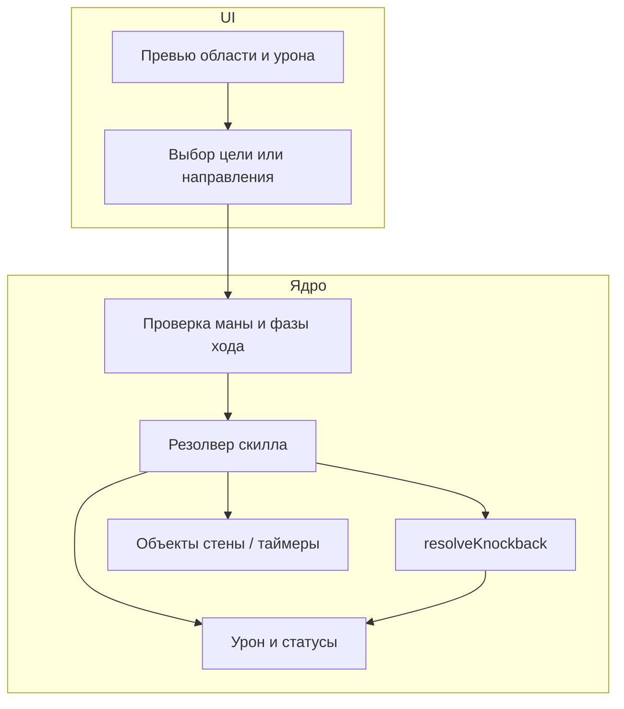

# План навыков: посох и меч (спецификация v2)

**Прогресс реализации в коде:** версия **0.5.8-pre-alpha** — см. перечень в [§11](#11-прогресс-реализации-в-коде).

Документ фиксирует дизайн новых скиллов и затрагиваемые системы движка. Ряд параметров (мана, редкость, точные формулы **N**) пока не заданы — помечены как TBD.

**Связанный код (исходное состояние)**

| Область | Файлы |
|--------|--------|
| Определения скиллов, таргетинг по видимости, применение | [`src/skillsRuntime.js`](../src/skillsRuntime.js) |
| Обёртка хода скилла | [`src/main.js`](../src/main.js) (`useSkillAtCellFromContext`, `trySelectPreparedSkillRoot`) |
| Урон меча «с руки», крит | [`src/rules.js`](../src/rules.js) (`calculateWeaponDamage`, `computeBasicMeleeDamage`) |
| Шаг в клетку с врагом | [`src/game/playerStep.js`](../src/game/playerStep.js) |
| Ход окружения, атака врага по игроку | [`src/game/environmentTurn.js`](../src/game/environmentTurn.js) |
| Статусы врага (стан, яд, горение) | [`src/game/trapsAndClouds.js`](../src/game/trapsAndClouds.js) (`ensureEnemyStatus`) |
| ИИ врагов | [`src/game/enemyAggro.js`](../src/game/enemyAggro.js), [`src/game/environmentTurn.js`](../src/game/environmentTurn.js) |

---

## 1. Текущие скиллы (на посохе) — кратко

Уже реализованы только два навыка, оба привязаны к `subtype: "staff"`:

- **Огненный шар** — видимая клетка в пределах **6** клеток (Чебышёв) + LoS; область **3×3**; горение; одна «точка применения» за каст.
- **Магический шлепок** — видимые враги; несколько выборов цели за каст; урон от уровня **персонажа**, не скилла.

Новая спецификация добавляет **другие режимы таргета** (направление луча, себя, кольцо вокруг игрока, расширенная дистанция для меча и т.д.), их нужно будет описать в `SKILL_DEFS`, превью и обработчиках клика.

---

## 2. Новые типы таргетинга (глоссарий)

Чтобы не путаться в UI и в коде, имеет смысл завести явные «виды» выбора (рабочие имена):

| Код режима | Когда используется | Что выбирает игрок |
|------------|-------------------|---------------------|
| `direction_ray_5` | Ледяной шип | Одно из **8** направлений от клетки игрока; эффект строится по лучу |
| `visible_cell` | Каменная стена (как частично у огненного шара) | Любая видимая клетка (включая занятую врагом — по спецификации) |
| `ring_8_self` | Ударная волна, Вихрь | Фиксированная область: 8 соседних клеток; возможно без второго клика |
| `visible_enemy` | Цепная молния, часть посохов | Один видимый враг первым шагом; дальше может быть автоматика |
| `self_buff` | Стальная стойка | Клетка игрока / подтверждение без цели |
| `enemy_adjacent_8` | Рассечение | Враг в одной из 8 соседних клеток |
| `enemy_axis_diag_2` | Выпад | Враг строго на расстоянии **2** по вертикали, горизонали или диагонали |
| `enemy_visible_point` | Превосходство | Любой видимый враг в пределах правил видимости |

Часть режимов можно собрать из уже существующих фильтров (`getVisibleCellsForPlayer`, проверки объектов на клетке), часть потребует новых функций валидации целей.

---

## 3. Посох — навыки

### 3.1. Ледяной шип

**Идея:** узкий контролируемый луч с падением урона по цепочке врагов и обрывом на стене карты.

**Фазы**

1. **Подготовка:** игрок выбирает **направление** (8 соседних направлений относительно текущей клетки игрока).
2. **Расчёт луча:** из центра клетки игрока по выбранному направлению перечисляются клетки **до 5 шагов** включительно (или меньше у края карты). Если на очередной клетке **стена уровня** (`grid === 1`), клетка стены **не получает урон как проходимый пол**, луч **обрывается** до неё (дальше клетки не считаются). Уточнение при реализации: нужно ли помечать «удар по стене» как FX без урона по юнитам за стеной — по желанию арта.
3. **Урон:** перебор клеток луча **по порядку от игрока**. На каждой клетке, где есть **враг**, выдаётся очередной «слот» затухания: первый враг на лучу — **N**, второй — **N/2**, третий — **N/4**, … (деление на 2 на каждом следующем враге).  
   **Зафиксировано:** пустые клетки **не** продвигают счётчик затухания — только клетки с врагом.
4. **Визуал:** снаряд-сосулька летит по траектории луча; урон логически можно применить по прилёту сегмента или в конце анимации — решение техническое.

**Параметры TBD:** формула **N** (ИНТ, уровень скилла, база), мана, редкость; можно ли задеть игрока при особой геометрии (обычно луч от себя — нет).

---

### 3.2. Каменная стена

**Идея:** временное препятствие на клетке + особые случаи при спавне на враге + взаимодействие с «пролетающими» заклинаниями.

**Применение**

- Цель: **любая видимая клетка** (аналогично огненному шару по видимости/LoS, если используется та же функция — проверить согласованность с «видимостью» стен).
- На клетке создаётся **объект мира**: непроходимый для перемещения, живёт **3 хода** (что считать ходом — см. открытые вопросы в §8).

**Если на клетке уже есть противник**

1. Нанести ему **N** урона.
2. **Оттолкнуть** от игрока (вектор от игрока к цели → продолжить по этой оси на одну клетку или на расстояние одного «шага» — уточнить при реализации длину толчка здесь; в тексте спецификации акцент на «от персонажа»).
3. Если отталкивание в выбранном направлении невозможно — **случайное** из допустимых направлений (или из свободных соседних клеток).
4. **Оглушение на 1 ход** на этом враге.

После толчка должен отработать **общий конвейер отталкивания** (§6): удар о стену (+20% макс. HP + стан), столкновение с другим врагом (оба 20% макс. HP — см. §8 про базу процента).

**Разрушение заклинанием**

- **Зафиксировано (базово):** если геометрия заклинания задаёт **луч от позиции кастера к точке применения**, и этот луч **пересекает** клетку со стеной — стена **уничтожается**, и значение **N** этой стены **добавляется к суммарному урону** этого заклинания (распределение по целям — решить: плоско ко всем задетым или только к главной цели — **TBD**).
- **AoE без явного луча** (например огненный шар с центром не на игроке): правило **не финализировано**; кандидат — разрушение только если **центр AoE** совпадает с клеткой стены, либо если любая клетка области покрывает стену — выбор за дизайнером.

**Интеграция с навигацией**

- Pathfinding игрока и ИИ должен учитывать клетку как блокирующую до истечения срока.
- При истечении срока объект удаляется без урона.

---

### 3.3. Ударная волна

**Идея:** короткий AoE вокруг игрока + массовый толчок.

- Область: **8 соседних клеток** (не включая клетку игрока).
- Урон **N** каждому врагу в области.
- Каждого задетого врага отталкивать на **2 клетки** **от центра игрока** (направление: из центра игрока через центр врага). При упоре в препятствие применяется §6.
- **Уточнить:** при отталкивании на 2 клетки промежуточная клетка должна быть свободна или допускается «скольжение» — это влияет на реализацию `resolveKnockback`.

---

### 3.4. Цепная молния

**Идея:** выбор стартовой цели + несколько автоматических прыжков с растущим множителем урона; может задеть игрока.

- **Старт:** игрок выбирает **видимого** врага.
- **Число прыжков:** **2–4** в зависимости от **уровня скилла** на предмете.
- **Радиус следующего прыжка:** от **текущей точки удара** (позиция последней поражённой цели) ищутся цели в радиусе **4** — метрика **Чебышёв или Евклид** (**TBD**).
- **Кандидаты:** другие враги **или игрок**. Если игрок в радиусе — он может быть выбран следующей «молний», если правило выбора это допускает (**TBD**).
- **Урон по порядку попаданий:** 1-я цель — **N**, 2-я — **2N**, 3-я — **3N**, …  
- **Открыто:** повтор одной цели в одном касте; нужен ли LoS между прыжками; при нескольких кандидатах — случайный выбор, ближайший, или исключение уже поражённых.

Рекомендуется заранее описать в тултипе возможность урона по себе, чтобы игрок не воспринимал это как баг.

---

## 4. Меч — навыки

### 4.1. Стальная стойка

**Идея:** короткий бафф с шансом контратаки тем же уроном, что обычный рукопашный удар с экипированным мечом.

- Тип таргета: **себя**.
- Длительность баффа **«Стальная стойка»:** **2 хода** (игрока или общих фаз — **TBD**, см. §8).
- Пока бафф активен: когда враг **совершает атаку по игроку** (ближняя атака из [`environmentTurn.js`](../src/game/environmentTurn.js)), с вероятностью **40% / 60% / 80%** (уровни 1 / 2 / 3 скилла или иная привязка — **TBD**) после получения урона игрок **контратакует** один раз с расчётом как у `computeBasicMeleeDamage` (без дополнительного расхода хода игрока).
- **Открыто:** одна контратака на всю волну атак или проверка на каждого атакующего отдельно; конфликт с порядком событий (смерть игрока от первой атаки — контратака не идёт).

Состояние баффа хранить на `run` или на `playerSheet` с уменьшением счётчика на нужной фазе хода.

---

### 4.2. Вихрь

**Идея:** AoE вокруг себя с тем же базовым уроном, что «тычка с руки», и **одним** общим броском крита на весь скилл.

- Область: **8 соседних клеток**.
- Базовый урон одной «доли» — как удар мечом по формуле [`calculateWeaponDamage`](../src/rules.js) + те же производные критов, что в [`computeBasicMeleeDamage`](../src/rules.js), но RNG крита вызывается **один раз**, множитель применяется ко всем попаданиям подряд за этот каст.

Уточнить баланс: множитель урона скилла относительно обычного одного удара (100% на цель или снижение за массовость).

---

### 4.3. Выпад

**Идея:** удар на дистанции 2 по линии + толчок вдоль линии рывка.

- Допустимые цели: враги в клетках с **манхэттенским или диагональным смещением ровно (±2,0), (0,±2), (±2,±2)** — восемь позиций.
- Урон от «тычки с руки» (или с множителем — **TBD**).
- Отталкивание цели на **2 клетки** в направлении **от игрока к цели** (продолжение луча). Далее §6.

---

### 4.4. Рассечение

**Идея:** точечный сильный удар по соседу + многослойный дебафф **«Кровотечение»**.

- Цель: враг в одной из **8** соседних клеток.
- Урон выше базового одного удара (**коэффициент TBD**).
- Накладывает **кровотечение на 3 хода**.

**Эффект «Кровотечение»** (новые поля в статусе врага или отдельная структура):

| Компонент | Эффект |
|-----------|--------|
| DoT | Каждый соответствующий тик: **20% от макс. HP** цели (**момент тика и минимальный урон — TBD**, сравнить с горением в коде). |
| Штраф атаки | Исходящий урон этого врага по игроку снижен на **20%** (модификация в месте расчёта урона врага). |
| Уязвимость к криту | По цели с кровотечением шанс крита атак игрока выше на **20% п.п.** или на **20% относительно** — **нужно однозначное правило**; также уточнить: только рукопашное или любой урон игрока. |

Совместимость с другими статусами и иконки в UI — по правилам проекта (русские тексты).

---

### 4.5. Превосходство

**Идея:** принудительно переключить поведение одного врага на атаку других врагов.

- Точечный выбор **видимого** врага.
- Накладывает **«Берсерк» на 3 хода**.

**Поведение под «Берсерк»:**

- Враг **не выбирает игрока** как цель ближней атаки, пока выполняется условие ниже.
- Если в **зоне видимости врага** есть **другие враги**, он атакует **ближайшего** из них (метрика расстояния — **TBD**, обычно Чебышёв как в текущем движении).
- Если подходящих врагов нет — поведение возвращается к атаке **игрока** как сейчас.

**Реализация:** потребуется отдельная ветка в ИИ перед блоком «расстояние 1 → удар по игроку» в [`environmentTurn.js`](../src/game/environmentTurn.js), либо отдельное состояние в [`enemyAggro.js`](../src/game/enemyAggro.js). Приоритет над `pursuit`/`search` — **явно зафиксировать** в §8.

---

## 5. Отталкивание — единый конвейер (`resolveKnockback`)

Любой скилл с толчком должен вызывать общую функцию (имя условное), которая:

1. По направлению и дистанции строит путь из клеток (с учётом стен, других блокирующих объектов, **каменной стены**, других врагов).
2. Перемещает юнита на финальную допустимую клетку (или пошагово на 2 клетки — как в спецификации для волны и выпада).
3. После остановки проверяет **тип столкновения**:

**Утверждено:**

- **Упёрся в стену** (или непроходимый тайл): дополнительный урон **20% от макс. HP** этого врага + **оглушение 1 ход**.
- **Упёрся в другого врага:** оба получают **20% от макс. HP** — **от чьего макс. считать каждому** (**TBD**, см. §8).

Дополнительно стоит описать:

- что происходит при толчке **в игрока** (если допускается);
- взаимно ли исключаются несколько модификаторов (стена + враг на одной клетке).

---

## 6. Каменная стена и заклинания — правило пересечения луча

Уже зафиксировано для типа «есть отрезок кастер → точка применения»:

- Если отрезок пересекает клетку стены — стена уничтожается, её **N** суммируется с уроном заклинания.

Требуется отдельное решение для:

- AoE с центром не на игроке;
- цепной молнии (нет одной «точки применения» в том же смысле);
- скиллов без проектиля из клетки игрока.

---

## 7. Синергии и будущие модификаторы (из плана)

Не входят в минимальный MVP скиллов, но заложить **одну точку расширения** полезно:

- Контекст источника урона и статусы цели до расчёта крита и после толчка.
- Идеи на потом: крит по оглушённым, горение + молния, маркировка посохом + добивание мечом, штраф за спам по одной цели и т.д.

Подробный список см. в истории обсуждения и при необходимости переносите в таблицу баланса.

---

## 8. Открытые уточнения (чек-лист для дизайна)

| № | Тема | Вопрос |
|---|------|--------|
| 1 | Длительность стены «3 хода» | Считать тики фазы игрока, окружения или абстрактные «раунды»? |
| 2 | Цепная молния | Повтор цели; LoS между прыжками; выбор следующей цели при равных кандидатах; метрика радиуса 4. |
| 3 | Кровотечение | Когда наносится DoT; нужен ли минимальный урон за тик; точное значение «+20% к криту» (п.п. или множитель). |
| 4 | Стальная стойка | Лимит контратак за один проход окружения; взаимодействие со смертью игрока. |
| 5 | Столкновение двух врагов при толчке | 20% макс. HP для каждого — от своего макс. или общая формула? |
| 6 | Берсерк | Приоритет над pursuit/search; критерий «ближайший враг» при равенстве. |
| 7 | Ударная волна / общий knockback | Пошаговое движение на 2 клетки vs телепорт на 2; промежуточная блокировка телом. |
| 8 | AoE и стена | Финальное правило для огненного шара и аналогов. |

После закрытия таблицы можно выставить **ману, редкость и формулы N** для каждого скилла и синхронизировать тексты тултипов без технического жаргона (правило проекта Mousefall).

---

## 9. Рекомендуемый порядок внедрения в коде

```text
1. [done] resolveKnockback + столкновение со стеной / вторым врагом + тесты на сетке
2. [done] Временный объект «каменная стена» (блок проходимость, таймер, FX)
3. [done] Ледяной шип (direction + луч + затухание по врагам)
4. [done] Ударная волна + Выпад (переиспользование knockback)
5. [done] Цепная молния + хук для разрушения стены по лучу + доп. урон
6. [done] Вихрь (общий крит RNG)
7. [done] Рассечение + кровотечение (DOT-тик в environment или свой слой)
8. [done] Стальная стойка + контратака из environmentTurn
9. [done] Превосходство + ветка ИИ берсерка
```

Автоматические юнит-тесты на сетке для knockback в репозитории пока не добавлены (проверка вручную в забеге).

Параллельно: новые `skillId` в [`skillsRuntime.js`](../src/skillsRuntime.js), превью в [`skillTargetingPreviews.js`](../src/game/skillTargetingPreviews.js), спрайты в [`src/assets/sprites/skills/`](../src/assets/sprites/skills/), строки в [`itemPresentation.js`](../src/items/itemPresentation.js) при необходимости.

---

## 10. Схема потока данных скилла



---

## 11. Прогресс реализации в коде

Состояние на **0.5.8-pre-alpha** (ключевые файлы):

| Пункт плана | Файлы / заметки |
|-------------|------------------|
| `resolveKnockback` | [`src/game/knockback.js`](../src/game/knockback.js) |
| Луч кастер→точка, стены | [`src/game/stoneWallRay.js`](../src/game/stoneWallRay.js); разрушение + бонус урона к огненному шару в [`src/skillsRuntime.js`](../src/skillsRuntime.js) |
| Каменная стена (таймер) | [`src/game/trapsAndClouds.js`](../src/game/trapsAndClouds.js) (`tickTemporaryObjects`), объект через `createStoneWallWorldObject` |
| Все новые скиллы (дефы + каст) | [`src/skillsRuntime.js`](../src/skillsRuntime.js), [`src/game/skillsPreparedCast.js`](../src/game/skillsPreparedCast.js) |
| Кровотечение, берсерк (поля статуса) | [`src/game/trapsAndClouds.js`](../src/game/trapsAndClouds.js) (`ensureEnemyStatus`), тик кровотечения в [`src/game/environmentTurn.js`](../src/game/environmentTurn.js) |
| Стальная стойка, контратака, берсерк ИИ | [`src/game/environmentTurn.js`](../src/game/environmentTurn.js) |
| Крит по цели с кровотечением (рукопашная) | [`src/rules.js`](../src/rules.js), [`src/game/playerStep.js`](../src/game/playerStep.js) |
| Превью областей | [`src/skillsRuntime.js`](../src/skillsRuntime.js) (`aggregateExtendedSkillPreview`), [`src/game/skillTargetingPreviews.js`](../src/game/skillTargetingPreviews.js) без изменений по контракту |
| FX полёта / попадания | [`src/render.js`](../src/render.js) |

**Частично / по умолчанию (TBD из §8):** точные формулы «N» и мана зафиксированы численно в коде как черновой баланс; цепная молния — случайный выбор следующей цели при равных кандидатах, метрика радиуса Чебышёва 4; кровотечение — +20 п.п. к шансу крита по цели; AoE огненного шара vs каменная стена без луча не менялись (по плану открыто).

---

*Версия документа: v2. Последнее обновление: по состоянию спецификации заказчика и зафиксированным ответам по ледяному шипу и каменной стене (луч кастер→точка).*
